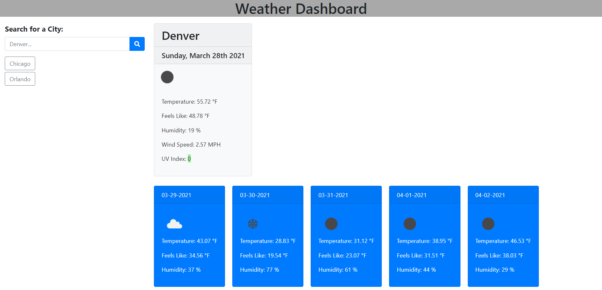

# 06-Server-Side-APIs-Weather-Dashboard

A Weather Dashboard

The goal of this site is to create a weather dashboard that will present the user with todays current weather data and then a future five day forecast. It will also store the past search results allowing the user to select them and see that cities weather data again.  

To use the dashboard type the name of a city in the search box and select the spyglass. As you search the city will be saved to a list allowing you to select them again for viewing.   

Below is a screen shot of the weather dashboard:

Below is a link to the site:

https://codyg-2021.github.io/06-Server-Side-APIs-Weather-Dashboard/

